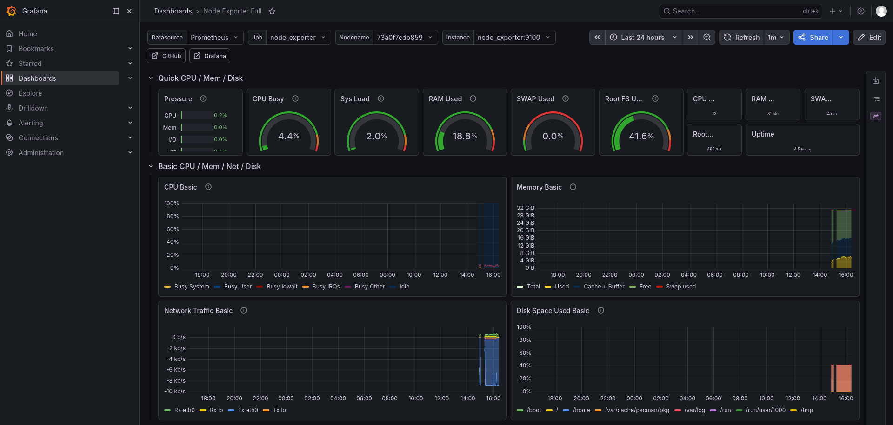
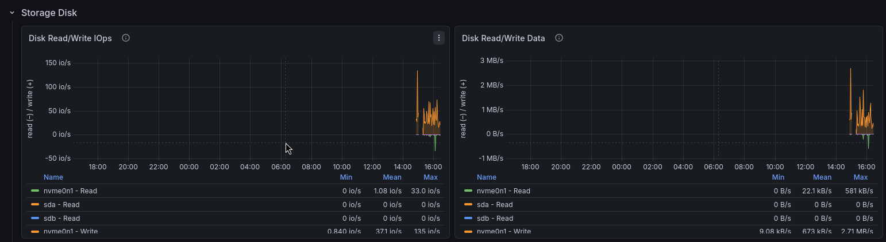
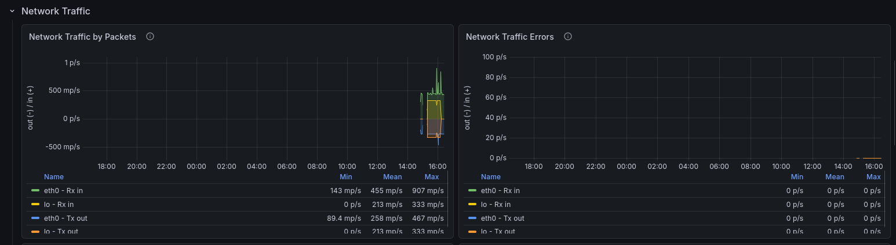
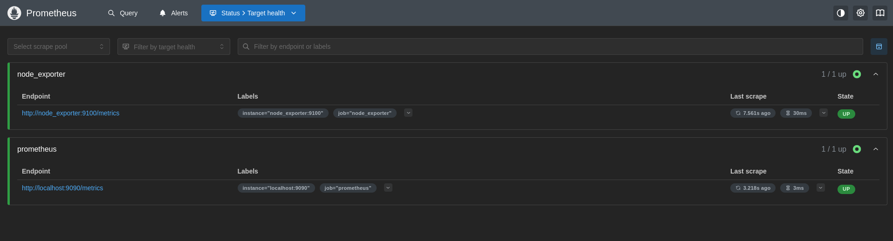
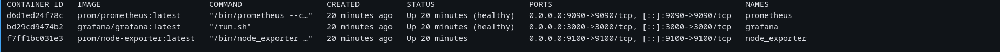

# Monitoring Stack with Docker Compose

## Stack

* Docker
* Docker Compose
* Prometheus
* Grafana
* Node Exporter
* Linux

## Architecture

```text
Node Exporter ---> Prometheus ---> Grafana
```

* Node Exporter collects host metrics
* Prometheus scrapes and stores metrics
* Grafana visualizes monitoring data

## Screenshots

### Grafana Dashboard Overview



### Storage & Disk Metrics



### Network traffic



### Prometheus Targets



### Docker containers



## Quick Start

```bash
git clone https://github.com/Senf-code/monitoring.git
cd monitoring
cp .env.example .env
docker compose up -d
```
