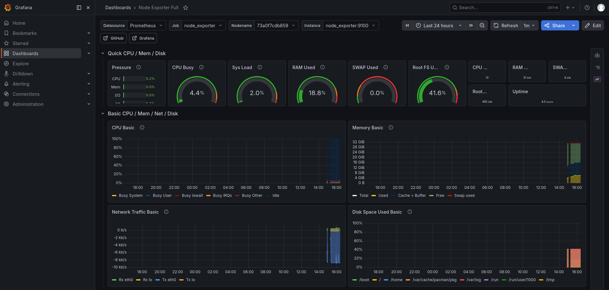
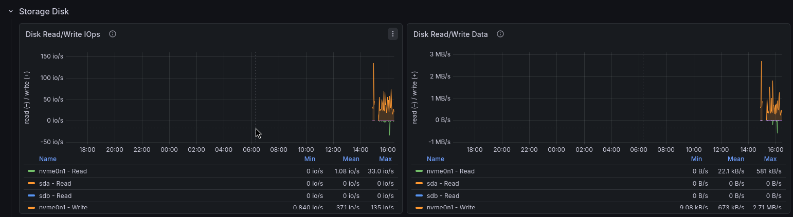
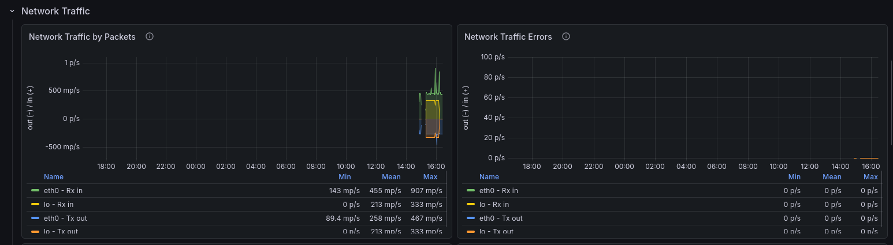
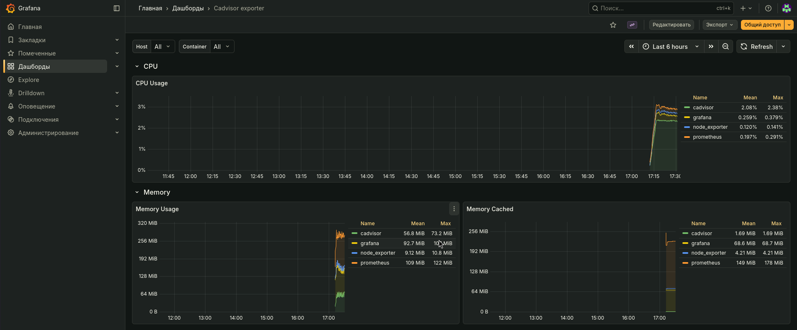
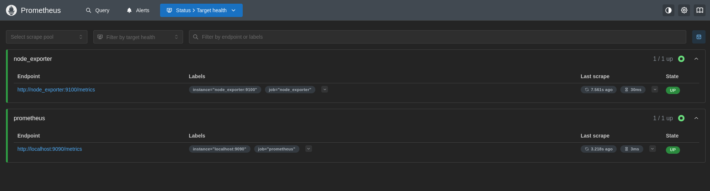
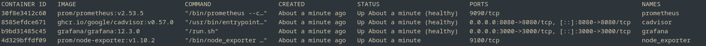

# Monitoring Stack with Docker Compose

## Описание проекта

Полный стек мониторинга для Linux-серверов на базе Docker Compose. Система собирает метрики CPU, RAM, диска и сети хост-системы и контейнеров, хранит их в Prometheus, визуализирует в Grafana и отправляет уведомления об инцидентах в Telegram через Alertmanager.

**Основные компоненты:**
- **Node Exporter** — собирает метрики хост-системы
- **cAdvisor** — мониторит потребление ресурсов и состояние контейнеров
- **Prometheus** — агрегирует и хранит метрики, вычисляет алерты
- **Alertmanager** — маршрутизирует алерты и отправляет уведомления в Telegram
- **Grafana** — визуализирует метрики в дашбордах

## Stack

| Компонент     | Версия  |
|---------------|---------|
| Prometheus    | v3.12.0 |
| Grafana       | v13.0.2 |
| Node Exporter | v1.11.1 |
| cAdvisor      | v0.57.0 |
| Alertmanager  | v0.27.0 |

## Architecture

```text
Node Exporter ──┐
                ├──> Prometheus ──> Alertmanager ──> Telegram
cAdvisor        │         │
                └─────────┴──> Grafana
```

- Node Exporter и cAdvisor собирают метрики хоста и контейнеров
- Prometheus scrape-ит цели каждые 15 секунд, вычисляет алерты по правилам
- Alertmanager принимает алерты от Prometheus и отправляет уведомления
- Grafana визуализирует метрики через datasource Prometheus

## Prerequisites

- Docker 24+
- Docker Compose v2
- Linux с cgroup v2 (требуется для cAdvisor; ядро ≥ 5.10)

## Quick Start

```bash
git clone https://github.com/Senf-code/monitoring.git
cd monitoring

# Настройка переменных окружения
cp .env.example .env
# Отредактировать GRAFANA_USER и GRAFANA_PASSWORD

# Настройка Alertmanager (опционально, см. раздел Alerting)
cp alertmanager.yml.example alertmanager.yml
# Отредактировать bot_token и chat_id

docker compose up -d
```

Grafana доступна по адресу `http://localhost:3000`.

## Alerting

Настроено 6 правил алертинга в двух группах.

### Правила

| Алерт                  | Severity | Условие                                  | Задержка |
|------------------------|----------|------------------------------------------|----------|
| InstanceDown           | critical | цель недоступна (`up == 0`)              | 1m       |
| HighCPULoad            | warning  | CPU > 85%                                | 5m       |
| HighMemoryUsage        | warning  | RAM > 90%                                | 5m       |
| DiskWillFillIn24Hours  | warning  | диск заполнится через 24 ч (прогноз)     | 30m      |
| ContainerHighCPU       | warning  | CPU контейнера > 80%                     | 5m       |
| ContainerHighMemory    | warning  | память контейнера > 80% лимита           | 5m       |

Алерты `critical` подавляют одноимённые `warning` для того же инстанса (inhibit_rules).

### Настройка Telegram-уведомлений

1. Создать бота через [@BotFather](https://t.me/BotFather), получить `bot_token`
2. Узнать свой `chat_id` (личный чат — положительное число, группа — отрицательное)
3. Заполнить конфиг:

```bash
cp alertmanager.yml.example alertmanager.yml
```

```yaml
# alertmanager.yml
receivers:
  - name: 'telegram'
    telegram_configs:
      - bot_token: '<YOUR_TELEGRAM_BOT_TOKEN>'
        chat_id: 123456789
```

### Проверка доставки алертов

```bash
docker exec alertmanager wget -qO- \
  --post-data='[{"labels":{"alertname":"TestAlert","severity":"critical","instance":"test"},"annotations":{"summary":"Тестовый алерт","description":"Проверка доставки уведомлений"}}]' \
  --header='Content-Type: application/json' \
  http://localhost:9093/api/v2/alerts
```

Alertmanager отправит уведомление через `group_wait` (30 секунд).

## Dashboards

В Grafana преднастроены дашборды:

| Дашборд             | Grafana ID |
|---------------------|------------|
| Node Exporter Full  | 1860       |
| cAdvisor            | 14282      |

## CI/CD

GitHub Actions пайплайн запускается на push в `develop` и `feature/**`, а также на PR в `main`.

**Шаги валидации:**
- `yamllint` — линтинг всех YAML-файлов
- `promtool check config` — валидация конфига Prometheus
- `promtool check rules` — валидация правил алертинга
- `amtool check-config` — валидация конфига Alertmanager

**Интеграционный тест:**
- Поднятие полного стека через `docker compose up -d`
- Ожидание healthy-статуса Grafana
- Проверка доступности Prometheus из контейнера Grafana
- Проверка поступления метрик Node Exporter

## Screenshots

### Grafana Dashboard Overview



### Storage & Disk Metrics



### Network traffic



### Cadvisor Dashboard



### Prometheus Targets



### Docker containers


